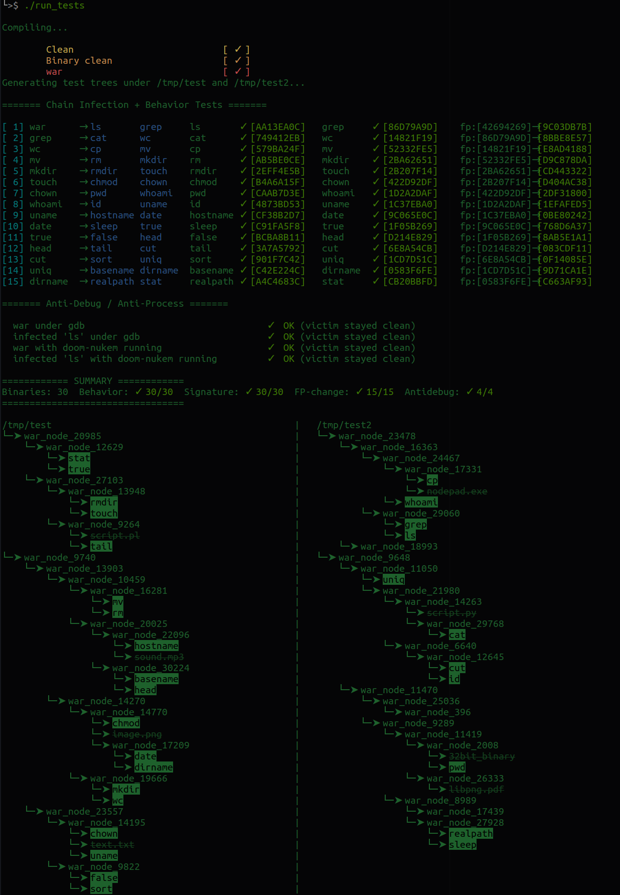

<div id="top"></div>

<div align="center">
 <a href="https://github.com/Link-Wolf/war" title="Go to GitHub repo"></a>
 <a href="https://"></a>
 <a href="https://github.com/Link-Wolf/war/stargazers"></a>
 <a href="https://github.com/Link-Wolf/war/network/members"></a>
 <a href="https://github.com/Link-Wolf/war/issues"></a>
 <a href="https://www.linux.org/" title="Go to Linux homepage"></a>
</div>

<!-- PROJECT LOGO -->
<br />
<div align="center">

  <h3 align="center">war</h3>

  <p align="center">
   <em>Polymorphic ELF64 Virus</em><br/>
    A polymorphic ELF64 virus, without harmful payload with <a href="https://github.com/sur4c1">iCARUS</a>
    <br />
    <br />
    <a href="https://github.com/Link-Wolf/war/issues">Report Bug</a>
    ·
    <a href="https://github.com/Link-Wolf/war/issues">Request Feature</a>
  </p>
</div>

<!-- TABLE OF CONTENTS -->
<details>
  <summary>Table of Contents</summary>
  <ol>
    <li>
      <a href="#goal">Goal</a>
    </li>
    <li>
      <a href="#getting-started">Getting Started</a>
      <ul>
        <li><a href="#prerequisites">Prerequisites</a></li>
        <li><a href="#installation">Installation</a></li>
      </ul>
    </li>
    <li><a href="#usage-examples">Usage examples</a></li>
    <li><a href="#contributing">Contributing</a></li>
  </ol>
</details>

<!-- GOAL -->

## Goal

<div align="center">
	
</div>
</br>

This project aims to understand how a polymorphic virus works and how to avoid detection. The program infects ELF64 binaries found in a target directory by injecting its own code into them, while mutating its signature at each duplication and/or execution to bypass signature-based detection.

> NOTE: This project builds upon [pestilence](https://github.com/Link-Wolf/pestilence), which introduce anti-debugging techniques already.

Since it's only a prototype, the program limits its reach to the `/tmp/test` and `/tmp/test2` directories. The infected files will still run normally — the virus silently executes before handing control back to the host binary, without printing anything or altering the original behavior.

> IMPORTANT: The program is an harmless and educational malware, as the only payload is the self-replication code and a small signature. But it's still a malware. So be aware and don't use it on your computer but on a virtual machine and more importantly don't use it for malicious purposes.

The signature and its mutation are done by mixing the inode of the file as well as its size and the current timestamp, including XOR operations and constant values.

<p align="right">(<a href="#top">back to top</a>)</p>

<!-- GETTING STARTED -->

## Getting Started

Because this project runs directly on the system, it is **strongly advised to use a virtual machine**. Do not run this on your personal machine or outside of a controlled environment.

### Prerequisites

- `make`
- `nasm`
- `clang`

The program is written in C and asm. It is designed to run on Linux x86-64 systems, and it may not work properly on other architectures or operating systems.

> NOTE: The program is tested on Ubuntu `22.04.03 LTS` / `x86-64` / `GNU Make 4.3` / `NASM 2.15.05` / `Clang 12.0.1`

### Installation

1. Clone the repo

    ```sh
    $> git clone https://github.com/Link-Wolf/war.git
    ```

2. Compile the program

    ```sh
    $> cd war
    $> make
    ```

3. Execute it

    ```sh
    $> ./war
    ```

<p align="right">(<a href="#top">back to top</a>)</p>

<!-- USAGE EXAMPLES -->

## Usage examples

Running the virus infects all ELF64 binaries found in `/tmp/test` and `/tmp/test2`.

Each infected file carries a signature of the form:

```
War version 1.0 (c)oded by xxxxxxx - yyyyyy - [B83CE2D6]
```

The signature at the end is a random 32-bit hexadecimal number that changes at each infection, confirming the polymorphic mutation is working as intended.

To observe this mutation between two infected files:
```
>$ mkdir /tmp/test /tmp/test2
>$ cp /bin/ls /tmp/test
>$ cp /bin/cat /tmp/test2
>$ ./war
>$ strings /tmp/test/ls | grep "War version"
War version 1.0 (c)oded by xxxxxxx - yyyyyy - [D6694187]
>$ strings /tmp/test2/cat | grep "War version"
War version 1.0 (c)oded by xxxxxxx - yyyyyy - [7AC59FBF]
```

And the self-mutation between each usage:
```
>$ ./war
>$ strings war | grep War
War version 1.0 (c)oded by xxxxxxx - yyyyyy - [4EF9B952]
>$ ./war
>$ strings war | grep War
War version 1.0 (c)oded by xxxxxxx - yyyyyy - [C3DD9CDC]
```

Note that the mutating signature on execution works on both the original and any infected binary

A tester `run_tests` is provided that compiles the virus, creates test trees under `/tmp`, runs the virus and check that everything works as expected.



> NOTE: Again, the project is based on [pestilence](https://github.com/Link-Wolf/pestilence), so everything will not be detailed here.

<p align="right">(<a href="#top">back to top</a>)</p>

<!-- CONTRIBUTING -->

## Contributing

If you have a suggestion that would make this better, please fork the repo and create a pull request. You can also simply open an issue with the tag "enhancement".
Don't forget to give the project a star! Thanks again!

1. Fork the Project
2. Create your Feature Branch (`git checkout -b feature/AmazingFeature`)
3. Commit your Changes (`git commit -m 'Add some AmazingFeature'`)
4. Push to the Branch (`git push origin feature/AmazingFeature`)
5. Open a Pull Request

<p align="right">(<a href="#top">back to top</a>)</p>
